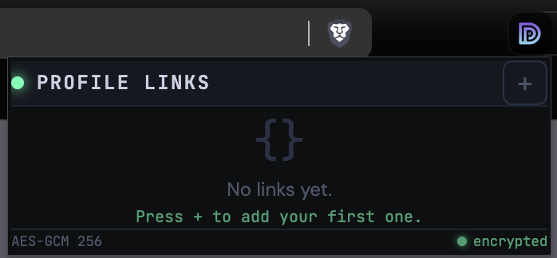
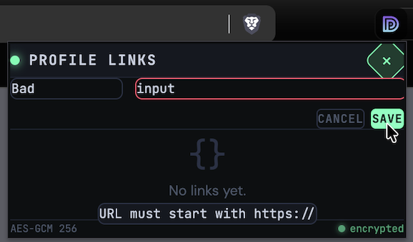
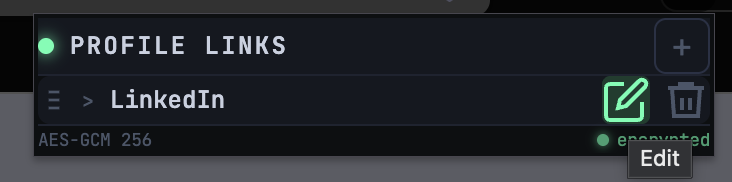
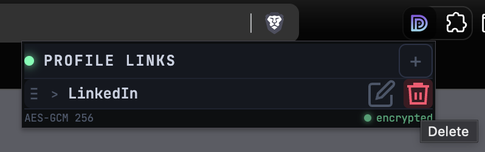
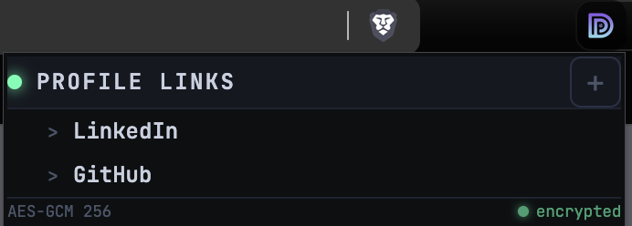
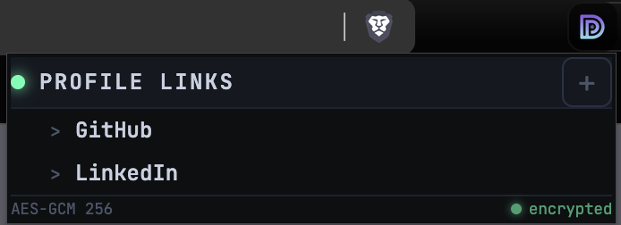
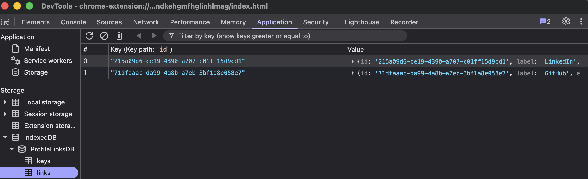

# Encrypted URL Manager

A Chrome extension that validates, encrypts, and stores your frequently used URLs client-side — so
you can copy them in one click without ever mistyping them again.

---

## The Problem

When applying for jobs, you repeatedly share the same handful of URLs — your LinkedIn profile,
GitHub, portfolio, resume. Copy-pasting from memory is error-prone: a missing `/in/`, a typo in your
username, or an outdated link can quietly undermine an otherwise strong application. This extension
puts the right URL on your clipboard in a single click, every time.

---

## Overview

**Encrypted URL Manager** is a Chrome extension built with React, TypeScript, and Tailwind CSS v4.
It stores your URLs locally in IndexedDB, encrypted with AES-GCM 256-bit encryption via the Web
Crypto API. No cloud. No accounts. No external dependencies at runtime.



---

## Features

- **One-click copy** — click any label to instantly copy its URL to your clipboard
- **AES-GCM 256-bit encryption** — URLs are encrypted at rest using the Web Crypto API; the key is
  auto-generated and stored locally
- **Input validation & sanitization** — labels are stripped of HTML special characters; URLs are
  validated to `http`/`https` only, blocking `javascript:` and `data:` schemes
- **Inline editing** — update a label or URL at any time without deleting and re-adding
- **Drag and drop reordering** — arrange your links in whatever order makes sense to you
- **Fully local** — everything lives in your browser's IndexedDB; nothing leaves your machine

---

## Screenshots

### Input Validation

Labels and URLs are validated before saving. Invalid or unsafe input is rejected with inline
feedback.



### Editing a Link

Click the pencil icon on any row to edit its label or URL inline.



### Deleting a Link

Hover a row to reveal the delete button.



### Drag and Drop Reordering

Drag the handle on the left of any row to reorder your links.




### Encrypted Storage

URLs are stored as AES-GCM 256-bit encrypted ciphertext in IndexedDB. You can verify this yourself
in Chrome DevTools under Application → IndexedDB → ProfileLinksDB → links.



---

## Tech Stack

| Layer      | Choice                       | Reason                                   |
| ---------- | ---------------------------- | ---------------------------------------- |
| Framework  | React + TypeScript           | Component isolation, type safety         |
| Build tool | Vite                         | Fast builds, clean output for extensions |
| Styling    | Tailwind CSS v4              | Utility-first, no runtime overhead       |
| Storage    | IndexedDB                    | Client-side, persistent, no size limits  |
| Encryption | Web Crypto API (AES-GCM 256) | Native browser crypto, no dependencies   |

---

## Design Decisions

**Why IndexedDB over a cloud database?** Firebase and Supabase were considered. Although the URLs
stored here are publicly accessible links, there was no compelling reason to send them to a cloud
database. IndexedDB keeps everything local, requires no authentication, and has no network
dependency. The data is also low-stakes — if it's ever lost, re-adding a handful of URLs takes under
a minute.

**Why encrypt at all?** The URLs stored here are public by nature, so this isn't about protecting
secrets. Encryption is implemented because it reflects real-world best practices for client-side
storage and demonstrates the correct pattern for when the stakes are higher.

**Why sanitize inputs?** Input sanitization and URL protocol validation guard against malformed data
and potentially harmful schemes like `javascript:` being stored or executed. It's considered
standard practice and costs nothing to implement correctly.

---

## Installation

> A packaged release will be available on GitHub. Until then, follow the steps below to load it
> manually.

### Prerequisites

- [Node.js](https://nodejs.org/) (v18 or higher)
- npm
- Brave, Google Chrome, or any Chromium-based browser

### Steps

**1. Clone the repository**

```bash
git clone https://github.com/Daegybyte/encrypted-url-manager.git
cd encrypted-url-manager
```

**2. Install dependencies**

```bash
npm install
```

**3. Build the extension**

```bash
npm run build
```

**4. Load in Chrome**

1. Open Chrome and navigate to `chrome://extensions`
2. Enable **Developer mode** using the toggle in the top right
3. Click **Load unpacked**
4. Select the `dist/` folder inside the project directory

The extension will appear in your toolbar. Pin it for easy access.

### Making changes

```bash
npm run dev     # start local dev server at localhost:5173 for UI development
npm run build   # rebuild dist/ for the extension
```

After any `npm run build`, click the reload button (↺) on the extension card in
`chrome://extensions` to pick up the changes.

---

## Verifying Encryption

To confirm your URLs are encrypted at rest:

1. Right-click the popup → **Inspect**
2. Go to the **Application** tab
3. Navigate to **Storage → IndexedDB → ProfileLinksDB → links**
4. The `encUrl` field will show base64-encoded ciphertext, not your URL
5. Check **keys** to see the stored AES key — it never leaves your browser
